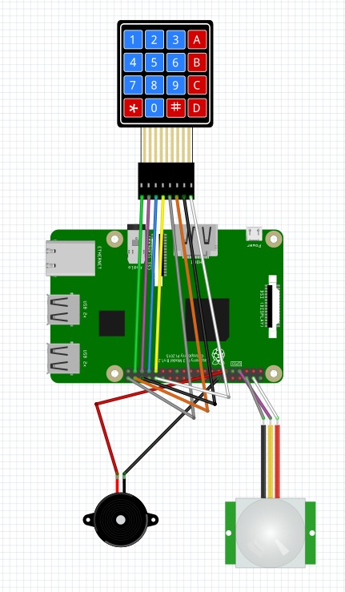

# Raspberry Pi security alarm

For the elective course in data science for IoT, I created a home security system using a Raspberry Pi. The Raspberry Pi is connected to a motion sensor, buzzer and a keypad. These sensors are controlled by Python code and send a notification to a phone when there is motion.


## Research

The goal of this project is to create a home security system for users when they are away from home. For this reason, I started researching what sensors are needed for this. 
I first looked at an ultrasonic distance sensor to detect motion. This sensor displays the distance between the sensor and the nearest object in front of it. The disadvantage of this is that the sensor will go off as soon as it is moved and give false positives.

Next, I started looking at a PiR motion sensor. This sensor measures the infra red radiation of all the objects in front of it and gives a signal as soon as there is movement. This allows the sensor to move in comparison without giving a false positive.

After this, I looked at how to get a user's attention that motion has been detected. For this, I chose to use a buzzer. A good buzzer can sound very loud and immediately grab a user's attention. Alternatively, it is also possible to link the Raspberry Pi to a speaker. For the project I just wanted to make the alarm system as compact as possible and chose to go for the buzzer because it is very small.

As a last sensor I researched how to retrieve a code from a user and verify it. I chose a matrix keypad because it is similar to normal home alarm systems. With this keypad I can retrieve input from users and compare the entered codes with a control code.

Finally, I started to explore how to combine the data from these sensors into a home security system. The two ways I investigated was to combine the data using an Arduino and a Raspberry Pi.

An Arduino is a microcontroller which means it is useful for simple tasks that are repeated often. It often controls sensors and motors such as opening a door or watering a plant.

A Raspberry Pi is not a microcontroller but a mini computer. This makes it possible to not only control sensors and motors but also run apps and connect to the internet out of the box. This allows the project to be expanded later with, for example, a website that displays when a sensor has gone off and stores the data in a database.
## List of required materials

- [Raspberry Pi](https://www.raspberrypi.com/products/raspberry-pi-4-model-b/)
- [PiR Sensor](https://www.kiwi-electronics.nl/nl/pir-bewegingssensor-3178)
- [Buzzer](https://www.allekabels.nl/buzzer-en-sirene/7374/1064517/buzzer.html)
- [Matrix board](https://www.benselectronics.nl/keypad-matrix-4x4.html)
## Raspberry Pi Design

The Raspberry Pi design was created using Fritzing. Fritzing is an open source tool that makes it easy to prototype electronic projects. Due to its user-friendliness, Fritzing is not only made for engineers but also for designers.

Make sure all cables are connected to the correct sensors according to the design in Fritzing below.



## Deployment

To run this project clone this git repository and make sure the Raspberry Pi is linked to all the sensors based on the fritzing design. See #fritzing to see how to put the Raspberry Pi together using the Pushover API.

Upload the repository on the Raspberry Pi and open the file motion.py.

In the Motion.py file, it is possible to turn on push notifications to the phone using Pushover. Go to the website of pushover<link to pushover> and create an account and an application there. Copy both API tokens to the file and set the pushoverEnabled variable to true

Once everything is ready, the project can be started using the following command line

```bash
  python motion.py
```


## Demo

There is a demo video of the project in the following link:
[Video](https://github.com/HRO-1001086/DataSienceForIoT/blob/master/screenshots/demo.mp4)